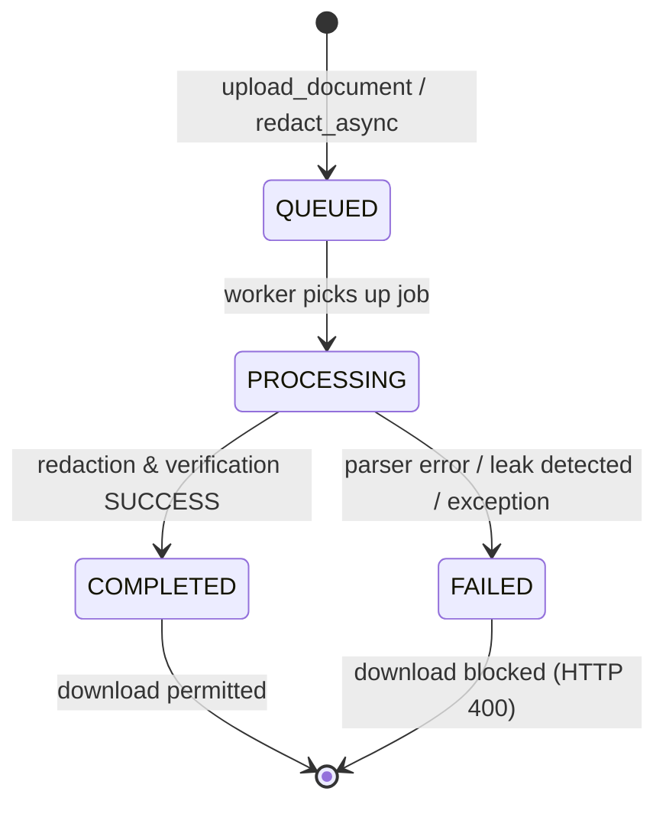

# Ciphera Backend Security Architecture
**Version:** 1.0 (Post E1-E6 Baseline Freeze)  
**Status:** Frozen ML Architecture & Hardened Security Core  
**Classification:** Core System Specification

---

## Executive Summary & Engineering Philosophy

Ciphera is an intelligent, zero-trust document anonymization and PII redaction engine designed specifically for high-assurance document processing (Healthcare, Finance, Government KYC, HR).

The foundational principle of Ciphera is **Maker-Checker Decoupling**:
1. **The Detection Engine ("Maker")** proposes candidate sensitive spans using multi-modal NER, regex, and contextual inference.
2. **The Redaction Engine** performs destructive coordinate-space wiping on native text streams and rasterized pixels.
3. **The Verification Engine ("Checker")** operates independently with zero trust in the Maker's claims, auditing the final rendered binary via pixel OCR, text-stream inspection, and geometry analysis before permitting artifact egress.

```
┌─────────────────────────────────────────────────────────────────────────────────────────────┐
│                                   CIPHERA CORE PIPELINE                                     │
└─────────────────────────────────────────────────────────────────────────────────────────────┘
                                    ORIGINAL PDF / IMAGE
                                             │
                                             ▼
                        ┌────────────────────────────────────────┐
                        │   1. Document Parsing & Geometry       │
                        │      (PyMuPDF 72pt + Tesseract OCR)    │
                        └────────────────────────────────────────┘
                                             │
                                             ▼
                        ┌────────────────────────────────────────┐
                        │   2. Detection Engine (Maker)          │
                        │      • High-Precision Regex            │
                        │      • Presidio Pattern Engine         │
                        │      • Transformer / Spacy NER         │
                        │      • Position-Aware OCR Normalizer   │
                        │      • Multilingual Hindi Pipeline     │
                        └────────────────────────────────────────┘
                                             │
                                             ▼
                        ┌────────────────────────────────────────┐
                        │   3. Decision & Policy Engine          │
                        │      • Context Scoring (+/- Deltas)    │
                        │      • Weighted Confidence Voting      │
                        │      • Structured-over-Generic Resolve │
                        └────────────────────────────────────────┘
                                             │
                                             ▼
                        ┌────────────────────────────────────────┐
                        │   4. Secure Redaction Engine           │
                        │      • Native PDF Stream Wiping        │
                        │      • Font Descender Padding (+2pt)   │
                        │      • Blackout Pixel Rasterization    │
                        └────────────────────────────────────────┘
                                             │
                                             ▼
                                     FINAL PDF BYTES
                                             │
                        ┌────────────────────┴───────────────────┐
                        │                                        │
                        ▼                                        ▼
           ┌──────────────────────────┐            ┌──────────────────────────┐
           │ Layer 1: GeometryVerifier│            │ Layer 2: VisualVerifier  │
           │ (BBox Residual Text Scan)│            │ (150 DPI Pixel OCR Scan) │
           └────────────┬─────────────┘            └─────────────┬────────────┘
                        │                                        │
                        └────────────────────┬───────────────────┘
                                             │
                                             ▼
                        ┌────────────────────────────────────────┐
                        │ Layer 3: Stream & Defrag Verifier      │
                        │ (Un-gated Global PII Regex Sweep)      │
                        └────────────────────────────────────────┘
                                             │
                                  ┌──────────┴──────────┐
                                  ▼                     ▼
                               [PASS]                [FAIL]
                           Download Ready        Hard Quarantine
                                                 (HTTP 500 / 400)
```

---

## 1. System Architecture

Ciphera is composed of four decoupled operational layers:
- **API Gateway & Routing Layer (FastAPI):** Asynchronous ASGI runtime enforcing JWT authentication, RBAC, tenant isolation, security headers, and rate limits.
- **Asynchronous Task Queue (Celery + Redis):** Distributed task execution runtime handling compute-intensive OCR, parsing, redaction, and multi-stage verification.
- **Relational Metadata Store (PostgreSQL):** Normalized schema storing users, organizations, memberships, document lifecycle states, and audit logs.
- **Storage Abstraction Layer (Local File / Cloud S3):** Isolated document vaults separating raw uploaded artifacts from completed redacted artifacts.

---

## 2. Detection Pipeline ("The Maker")

The Detection Pipeline extracts candidate sensitive spans through five distinct sub-stages:

### 2.1 Candidate Extractors
- **`RegexStage`**: High-speed, deterministic regular expressions for structured Indian and global identifiers (`PAN_NUMBER`, `AADHAAR_NUMBER`, `GST_NUMBER`, `IFSC_CODE`, `BANK_ACCOUNT`, `PHONE_NUMBER`, `EMAIL_ADDRESS`, `PIN_CODE`, `DRIVING_LICENCE`, `UPI_ID`).
- **`PresidioStage`**: Context-aware recognizers leveraging Microsoft Presidio Analyzer with custom regex registries and language tokenizers.
- **`SpacyNERStage`**: Statistical and transformer-based Named Entity Recognition (`en_core_web_trf` with fallback to `en_core_web_lg`) extracting unstructured `PERSON`, `ORGANIZATION`, `LOCATION`, and `DATE_TIME` spans.
- **`HindiPipeline` & `HindiRegexStage`**: Native Devanagari script extractors using `xx_ent_wiki_sm` and Devanagari numeral/keyword patterns.

### 2.2 Spatial Defragmentation
To recover spaced or multi-line PII (e.g. `1 1 2 2   3 3 4 4   5 5 6 6` or broken emails/phones across newlines), text is extracted into dense character maps paired with bidirectional source index pointers:
$$\text{DenseMap}: \{(c_i, \text{orig\_idx}_i)\}$$
Patterns are matched across dense strings and projected back to canonical document offsets without modifying raw document text.

### 2.3 Position-Aware OCR Normalization
Characters subject to OCR substitution noise (`l/I -> 1`, `O -> 0`, `3/8 -> B`, `5 -> S`) are normalized strictly **within** bounded candidate envelopes. Global document string replacement is prohibited to prevent precision degradation on surrounding text.

---

## 3. Decision & Conflict Resolution Pipeline

When multiple candidate extractors flag overlapping or competing spans, the `DecisionEngine` and `MixedDocumentHandler` execute deterministic arbitration:

### 3.1 Structured-over-Generic Precedence Rule
Structured PII candidates (e.g., validated `PAN_NUMBER`, `AADHAAR_NUMBER`, `DATE_OF_BIRTH`) **always supersede** generic statistical NLP labels (`PERSON`, `ORGANIZATION`, `DATE_TIME`), regardless of raw confidence scores:
$$\text{Priority}(\text{Structured\_PII}) \gg \text{Priority}(\text{Generic\_NLP})$$

### 3.2 Context Scoring & Gating
Confidence scores are dynamically boosted or suppressed based on surrounding lexical context windows ($\pm 35$ to $\pm 60$ characters):
- **Positive Boosts:** Presence of semantic anchors (e.g., `"Aadhaar:"`, `"PAN:"`, `"Name:"`, `"DOB:"`) adds $+0.10$ to $+0.12$.
- **Suppression Penalties:** Presence of non-PII keyword indicators (e.g., `"tracking"`, `"order"`, `"version"`, `"ref"`, `"apartment"`) penalizes candidates by $-0.15$ to $-0.90$.

### 3.3 Weighted Confidence Voting
Candidates surviving context gating are consolidated via weighted voting:
$$\text{FinalScore} = \max_{s \in \text{Sources}}(w_s \cdot \text{Score}_s) + \Delta_{\text{context}}$$
Where $w_{\text{regex}} = 1.4$, $w_{\text{presidio}} = 1.2$, $w_{\text{spacy}} = 1.0$.

---

## 4. Redaction Pipeline

Redaction in Ciphera is **destructive and non-reversible**:
1. **Native Text PDF Wiping**: Calls PyMuPDF's `page.add_redact_annot(rect)` followed by `page.apply_redactions()`. This physically removes text glyphs, font pointers, and character objects from the PDF content stream rather than merely drawing an overlay box.
2. **Descender & Ascender Padding**: Redaction rectangles are expanded by $+2.0\text{ pt}$ on all bounding borders to ensure complete annihilation of font descenders (`g`, `y`, `p`, `q`, `j`) and capital accents.
3. **Rasterized Image Blackout**: For scanned documents and raster images, target pixel arrays are overwritten with solid opaque blackout pixels ($0x000000$), permanently destroying underlying pixel data.

---

## 5. Zero-Trust Verification Boundary ("The Checker")

The Verification Engine enforces three independent security layers on the post-redaction binary artifact:

| Layer | Component | Verification Mechanism | Failure Consequence |
|---|---|---|---|
| **Layer 1** | `GeometryVerifier` | Queries PyMuPDF `page.get_text("text", clip=bbox)` inside all requested redaction rectangles. | If $>1$ residual alphanumeric char remains $\rightarrow$ **FLAG LEAK**. |
| **Layer 2** | `VisualVerifier` | Renders the redacted document at 150 DPI into PNG pixels $\rightarrow$ runs Tesseract OCR $\rightarrow$ audits character shape patterns (`LLLLLDDDDL`, `DDDDDDDDDDDD`). | If visual signature of PAN/Aadhaar is recovered $\rightarrow$ **FLAG LEAK**. |
| **Layer 3** | `TextStreamVerifier` | Runs un-gated security regex sweeps across the entire final document stream and defragmented character arrays. | If unredacted PII is detected $\rightarrow$ **FLAG LEAK**. |

### Quarantine Policy
If any verification layer detects a leak:
1. `VerificationEngine` raises `HTTPException(500, detail="Verification failed: X leaks found")`.
2. The asynchronous task transitions to `JobStatus.FAILED`.
3. The generated artifact is deleted or quarantined.
4. The download endpoint returns `400 Bad Request` (`"Job not completed"`).

---

## 6. Multi-Tenant Isolation & Authorization Model

```
                    ┌──────────────────────────┐
                    │      Client Request      │
                    └─────────────┬────────────┘
                                  │ (Bearer JWT Token)
                                  ▼
                    ┌──────────────────────────┐
                    │  get_current_user (Auth) │
                    └─────────────┬────────────┘
                                  │
                                  ▼
                 ┌────────────────────────────────┐
                 │ _get_doc_for_user (Isolation)  │
                 │                                │
                 │ 1. Doc exists?                 │
                 │ 2. Role == "super_admin"?      │
                 │ 3. doc.org_id in user_orgs?    │
                 │ 4. doc.uploaded_by == user.id? │
                 └────────────────┬───────────────┘
                                  │
                        ┌─────────┴─────────┐
                        ▼                   ▼
                     [MATCH]             [NO MATCH]
                     Proceed           HTTP 404 NOT FOUND
                                    (Prevents IDOR & Enum)
```

- **IDOR Protection**: Requests targeting documents outside the authenticated user's organization return `404 Not Found` (rather than `403 Forbidden`) to eliminate object existence enumeration.
- **Direct Object Reference Guarding**: All document endpoints (`/canonical`, `/entities`, `/redact`, `/download`, `/jobs/{id}`) pass through `_get_doc_for_user()`.

---

## 7. Storage Model

Ciphera maintains strict physical and logical storage separation:
- **`uploads/` Vault:** Raw, unredacted client files accessible only during initial parsing and redaction execution.
- **`redacted/` Vault:** Verified, anonymized final PDF artifacts.
- **Ephemeral Scratch:** In-memory byte buffers (`io.BytesIO`) and temporary working files cleaned up immediately upon task completion or failure.

---

## 8. Job State Machine & Lifecycle Transitions



### Transition Integrity Rules
- **No Resurrection:** `FAILED` jobs can never transition to `COMPLETED`.
- **Download Guard:** Direct artifact retrieval is permitted **strictly** when `job.status == JobStatus.COMPLETED`.

---

## 9. Coordinate Systems & Geometry Mapping

Ciphera manages coordinate transformations between three disparate spaces:
1. **PDF User Space (Points):** Standard 72 points per inch ($1\text{ pt} = 1/72\text{ in}$).
2. **Raster / Pixmap Space (Pixels):** Rendered images at 150 DPI or 300 DPI:
   $$\text{Scale Factor} = \frac{72.0}{\text{DPI}}$$
   $$\text{Box}_{\text{PDF}} = \text{Box}_{\text{Raster}} \times \text{Scale Factor}$$
3. **Rotated Page Geometry:** Bounding boxes on pages with $90^\circ, 180^\circ, 270^\circ$ orientation are mapped through PyMuPDF transformation matrices before applying redaction annotations.

---

## 10. Failure Handling & Resilience Strategy

| Failure Scenario | Engine Response | Data Integrity Outcome |
|---|---|---|
| **Corrupted / Truncated PDF** | `DocumentParser` catches `fitz.FileDataError` $\rightarrow$ raises `400 Bad Request`. | No partial DB entry; clean rejection. |
| **Verification Leak Detected** | `VerificationEngine` raises `HTTPException(500)` $\rightarrow$ job marked `FAILED`. | Unredacted artifact wiped; zero download exposure. |
| **Worker Process Crash** | Celery task timeout / termination $\rightarrow$ job remains un-completed. | Incomplete artifact never promoted to storage. |
| **Database Disconnection** | Transaction rollback $\rightarrow$ database returns connection error. | Zero orphaned records. |

---

## 11. Threat Model

| Threat Actor / Vector | Description | Ciphera Mitigation |
|---|---|---|
| **Malicious Tenant (IDOR)** | Authenticated user attempts to access another organization's document or job ID. | Strict query filtering in `_get_doc_for_user`; returns generic `404`. |
| **Adversarial PII Obfuscation** | Sensitive data formatted with broken spacing (`1 1 2 2`), OCR typos (`1l22 3344 55O6`), or multi-line breaks. | Dense-map spatial defragmentation + position-aware OCR normalizers. |
| **Under-Redaction / Leak** | Statistical ML model misses an obscure PII instance. | Zero-Trust Verification Engine (OCR + residual stream sweep) catches and blocks release. |
| **Pixel Scraping / Layer Peeking** | Attacker extracts underlying text from native PDF streams after visual blackout. | PyMuPDF destructive text stream removal (`apply_redactions`) removes glyphs permanently. |

---

## 12. Security Guarantees & Verification Matrix

To ensure absolute engineering transparency, Ciphera classifies all operational claims into three explicit categories:

### A. Proven (Empirically Verified by Automated Test Suites)
- [x] **Destructive Removal:** Redacted native text strings cannot be extracted via PyMuPDF `page.get_text()` (Verified across PAN, Aadhaar, Phone, Email, DOB, Bank Accounts).
- [x] **Zero-Trust Verification Catch Rate:** Injected unredacted PII is caught 100% of the time by independent verification layers and blocked from download.
- [x] **Cross-Tenant IDOR Blockade:** Zero unauthorized cross-tenant read/write/redact access across all document endpoints.
- [x] **Descender Annihilation:** Padding margins ($+2\text{ pt}$) completely cover low-hanging font descenders.
- [x] **Rotated Page Geometry:** Redaction coordinates correctly wipe rotated $90^\circ$ PDF pages.
- [x] **Historical Benchmark Cleanliness:** 1.0000 Precision, 1.0000 Recall, 0 FP, 0 FN across the frozen 11-document regression benchmark.

### B. Tested but Limited (Demonstrated on Current Test Sets; Scope Bound)
- [~] **Adversarial Formatting Robustness:** F1 = 0.8571 on 5 synthetic stress-test documents (some multi-line PERSON splits remain challenging).
- [~] **Hard-Negative Specificity:** 13 false positives observed across 10 decoy non-PII documents (AWBs, SKU codes, server logs trigger unspaced bank/aadhaar rules).
- [~] **Realistic Synthetic Domain Recall:** 91.89% recall on multi-paragraph hospital, HR, GST invoice, and insurance forms.
- [~] **Bilingual Hindi Coverage:** Proven on standard Devanagari labels and numerals; complex regional dialect variations not yet benchmarked.

### C. Not Yet Guaranteed (Requires Future Research / Production Scaling)
- [ ] **Arbitrary Document Universal 0 FP:** The system will produce false positives on unseen arbitrary documents with exotic layouts, dense tabular logs, or proprietary serial schemes.
- [ ] **Hardware-Isolated HSM Key Management:** Encryption keys are currently managed via environment/cloud secrets rather than hardware security modules.
- [ ] **Zero-Day PDF Exploit Hardening:** Pathological PostScript/PDF engine memory vulnerabilities in underlying C libraries (`libmupdf`, `tesseract`) require OS-level sandboxing (e.g. gVisor / seccomp).

---

## 13. Test Coverage & Benchmark Baseline Summary

| Suite / Test Group | Files | Test Count | Pass Rate |
|---|---|:---:|:---:|
| **Position-Aware Aadhaar OCR** | `test_e1_aadhaar_ocr.py` | 9 | **100%** (9/9) |
| **Independent Verification Engine** | `test_verification_engine.py`, `test_verification_failure_audit.py` | 8 | **100%** (8/8) |
| **Multi-Tenant Security & IDOR** | `test_e3_e4_security_audit.py`, `test_api_security.py` | 11 | **100%** (11/11) |
| **Coordinate Geometry & Rotations** | `test_geometry.py`, `test_verification_geometry.py` | 8 | **100%** (8/8) |
| **End-to-End Adversarial Destruction** | `test_e5_e6_destruction.py` | 10 | **100%** (10/10) |
| **Context Gating Regressions** | `test_fp_01_context_gating.py` | 2 | **100%** (2/2) |
| **Total Automated Pytest Suite** | **6 Test Modules** | **48 Tests** | **100% PASS** |

---

*Document approved for research publication, architectural review, and compliance auditing.*
